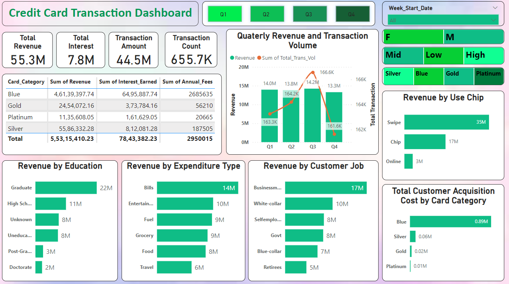
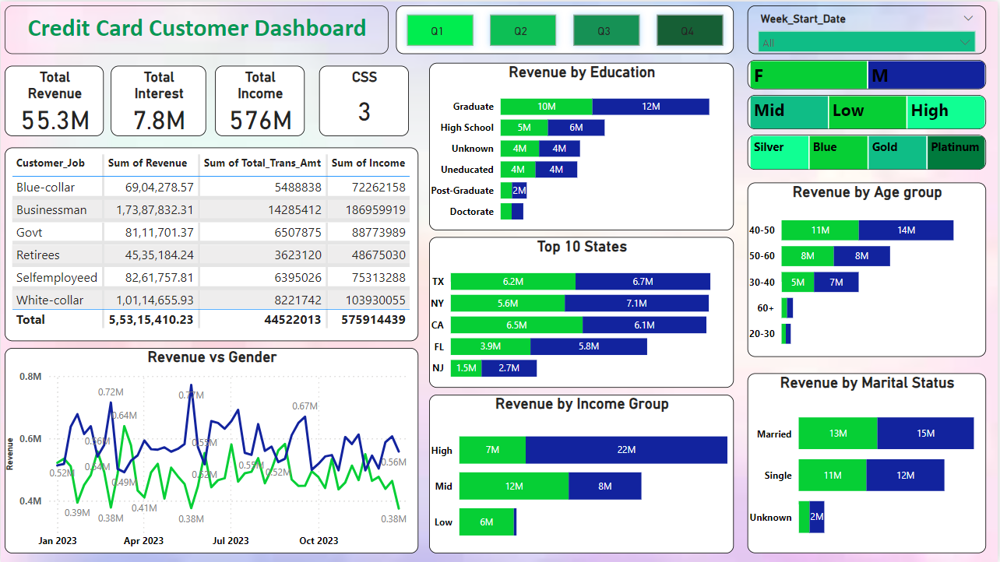

# CreditCard_Status_Report

This project involves analyzing credit card customer and transaction data to provide insights into various metrics such as revenue, interest, and transaction volume. Two dashboards were created to visualize the data and help make informed decisions.

## Dashboards

### Credit Card Transaction Dashboard

  

This dashboard focuses on transaction details and includes:  

- **Total Revenue:** Displays the total revenue from transactions.  
- **Total Interest Earned:** Shows the total interest earned from transactions.  
- **Transaction Amount:** Indicates the total amount transacted.  
- **Transaction Count:** The total number of transactions made.  
- **Card Category:** Sum of revenue, interest earned, and annual fees by card categories (Blue, Gold, Platinum, Silver).  
- **Quarterly Revenue and Transaction Volume:** A graphical representation of revenue and transaction volume across different quarters.  
- **Revenue by Education:** Revenue distribution based on the education level of customers.  
- **Revenue by Expenditure Type:** Breakdown of revenue by different expenditure types such as Bills, Entertainment, Fuel, Grocery, Food, and Travel.  
- **Revenue by Customer Job:** Revenue generated from customers in different job categories.  
- **Revenue by Use Chip:** Transaction revenue based on the method of use (Swipe, Chip, Online).  
- **Total Customer Acquisition Cost by Card Category:** Displays the customer acquisition cost for different card categories.  

### Credit Card Customer Dashboard

  

This dashboard provides a comprehensive view of the credit card customers. It includes the following key sections:  

- **Total Revenue:** Displays the total revenue generated.  
- **Total Interest:** Shows the total interest earned.  
- **Total Income:** Indicates the overall income from credit card customers.  
- **Customer Satisfaction Score (CSS):** Measures customer satisfaction on a scale of 1 to 5.  
- **Customer Job:** Sum of revenue, transaction amount, and income by different job categories such as Blue-collar, Businessman, Govt, Retirees, Self-employed, and White-collar.  
- **Revenue by Education:** Revenue distribution based on the education level of customers.  
- **Top 10 States:** Revenue generated from the top 10 states.  
- **Revenue by Age Group:** Breakdown of revenue by different age groups.  
- **Revenue by Income Group:** Revenue segmentation based on income levels.  
- **Revenue by Marital Status:** Distribution of revenue among married, single, and unknown marital status categories.  
- **Revenue vs Gender:** Trends in revenue based on gender over time.  

## Work Performed on the Dataset

### Data Collection  
- **Customer Data:** Collected data on customer demographics, job categories, education levels, age groups, income levels, marital statuses etc.  
- **Transaction Data:** Gathered data on transaction amounts, counts, card categories, expenditure types, usage methods etc.    

### Data Cleaning  
- **Missing Values:** Handled missing values by either imputing them with appropriate values or removing the records, depending on the context.  

### Data Transformation  
- **Aggregation:** Aggregated data to compute total revenue, interest earned, and transaction counts.  
- **Segmentation:** Segmented data by various categories such as customer job, education, age group, income level, marital status, and card category.  

### Data Visualization  
- **Dashboards:** Created interactive dashboards to visualize key metrics and insights.  
- **Charts and Graphs:** Used various charts and graphs to represent data in an easily understandable format.  
- **Filters and Interactivity:** Added filters and interactive elements to allow users to drill down into specific segments and time periods.  

